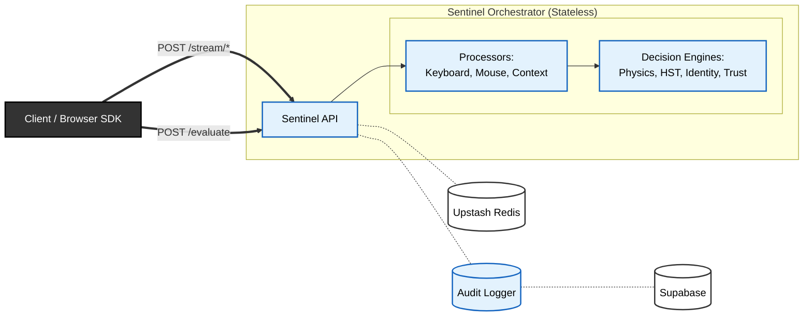

# Sentinel System Architecture

Sentinel follows a **stateless processing / stateful storage** pattern designed to scale horizontally while maintaining strict consistency for user trust scores.

## High-Level Layout

## Core Components
- **Client (Next.js):** Captures high-frequency telemetry (mouse, keyboard) via non-blocking beacons
- **Orchestrator (FastAPI):** Ingests streams, fuses signals, computes dynamic risk
- **State Store (Upstash Redis):** Ephemeral session context (<5ms latency), shared blacklist/strike state
- **Audit Logger:** Writes structured evaluation results to Supabase `audit_logs` with GeoIP enrichment
- **Auditor (RAG Agent):** Reviews flagged sessions against security policy, escalates provisional bans

### Orchestrator Detail
The Orchestrator is the central controller. It:
*   Receives incoming event batches.
*   Hydrates the user's state from Upstash Redis.
*   Routes data to the appropriate ML models.
*   Updates the trust score based on model outputs.
*   Decides on an action (ALLOW, CHALLENGE, BLOCK).

### Models (Intelligence)
Statistical and ML models that analyze behavior.
*   **Physics Models** (`PhysicsMouseModel`): Deterministic detection of impossible human movements using tiered biomechanical thresholds. Zero ML, zero learning.
*   **Teleportation Detection**: Orchestrator counts MOVE events between CLICKs. <3 MOVEs before a click = cursor teleported (physically impossible with a real hand). Ratio becomes a standalone risk signal.
*   **Anomaly Models** (`KeyboardAnomalyModel`): River Half-Space Trees for online anomaly detection on keystroke dynamics. Persistent per-user in Supabase. Used for both generic "human" detection (HST) and per-user identity verification.
*   **Navigator Policy Engine** (`NavigatorPolicyEngine`): Stateless rule engine for context-based risk (unknown user agent, device mismatch). Includes TOFU (Trust On First Use) — first session's context is pinned and deviations are flagged.

### Persistence Layer (Memory)
*   **Redis (Upstash, Hot Storage)**: Stores session state, trust score, temporal windows, blacklist keys, and strike counters. Shared with the Auditor service — a single Upstash instance serves both Sentinel ML and the Auditor. Uses optimistic locking (WATCH/MULTI/EXEC) for consistency under concurrent requests.
*   **Supabase (Cold Storage)**: Persists long-term user profiles and audit logs for post-incident analysis.

## Scaling Strategy

Sentinel is designed to be **stateless at the compute layer**. Any Sentinel API node can handle a request for any user, as long as it can reach the shared Redis cluster. This allows you to scale the API tier horizontally by simply adding more workers.

No single request contains enough information to authenticate a user; trust emerges only through state accumulation.

*Note: A Redis outage degrades Sentinel to a fail-safe CHALLENGE mode rather than hard ALLOW.*
