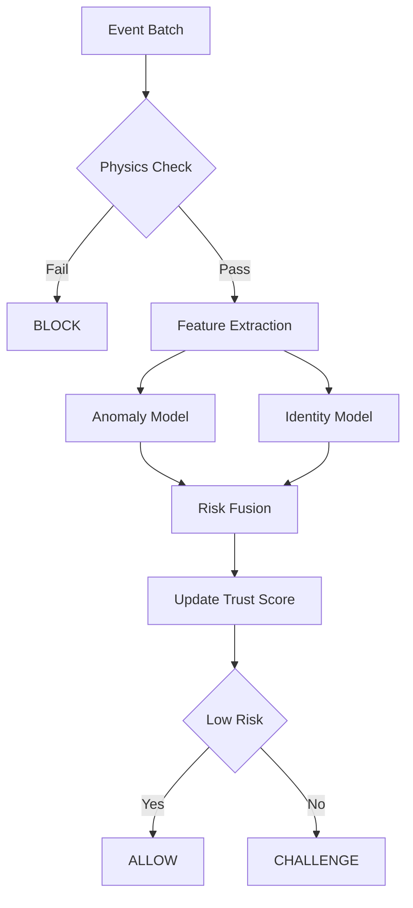
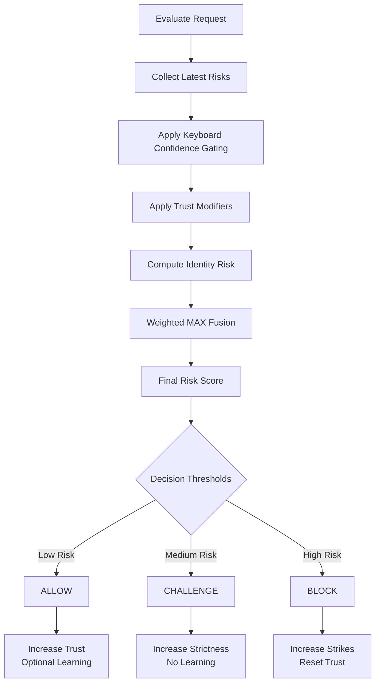
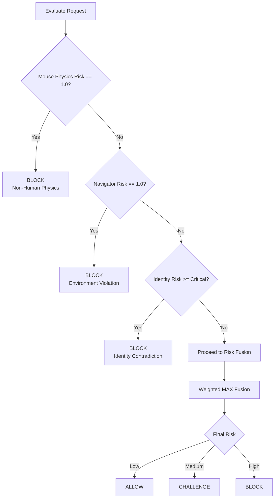

# The Sentinel Decision Engine 

The heart of Sentinel is the Decision Engine, which converts raw signals into a unified trust score.

## Risk Philosophy: Time-Variant Trust

Sentinel does not believe trust is static. Just because you logged in successfully 10 minutes ago does not mean you are still the same person. Trust decays over time unless reinforced by positive behavior.

## Trust Phases

> **Note**: Trust Score ranges from 0.0 (no trust) to 1.0 (fully trusted). Lower scores indicate higher risk.

### 1. Cold Start
*   **State**: `UNKNOWN`
*   **Duration**: First ~10-20 events.
*   **Logic**: High scrutiny. Any bot-like signal (e.g., zero dwell time on keys) triggers an immediate block. Identity models are disabled (not enough data).

### 2. Trust Formation
*   **State**: `VERIFYING`
*   **Duration**: Until trust score > 0.8.
*   **Logic**: The system aggregates positive evidence. Consistent, human-like behavior gently pushes the score up.

### 3. Mature Session
*   **State**: `TRUSTED`
*   **Duration**: Remainder of session.
*   **Logic**: The user has "proven" themselves. The system relaxes. Minor anomalies are ignored (noise), but structural anomalies (e.g., changing typing patterns entirely) cause a "Trust Crash," resetting the phase.

## Logic & Gating

### Trust Stabilizer
To prevent jittery scores (e.g., 0.8 -> 0.4 -> 0.9 in seconds), Sentinel uses an **Exponential Moving Average (EMA)** for the trust score. This smoothes out noise while reacting quickly to sustained drops.

### Gating Rules
Not all signals are equal.
*   **Physics Gate**: If a movement is physically impossible (teleportation), risk is set to 1.0 immediately, overriding all ML models.
*   **Identity Gate**: We do not penalize a user for "not looking like themselves" until we have at least 500 historical events for them.

## Weighted Fusion Formula

The final risk score is not a simple average. It uses a **Weighted MAX Fusion** approach to prioritize the strongest threat signal:

$$ Risk_{final} = \max(Risk_{physics}, Risk_{anomaly} * 0.7 + Risk_{identity} * 0.3) $$

*Note: Physics risk is binary and non-negotiable; ML-derived risks are probabilistic. If `Risk_physics` is triggered, it dominates specific detection.*

## Logical Decision Flowchart

## Risk fusion & Decision Lifecycle

## Override & Priority Rules

